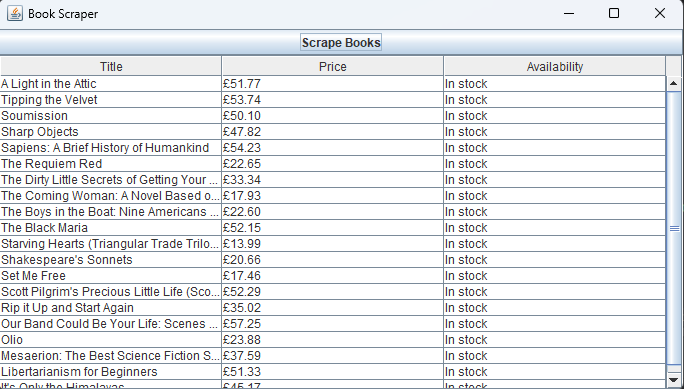

# 📘 BookScraperGUI

A simple Java GUI application that scrapes book titles, prices, and availability from [books.toscrape.com](https://books.toscrape.com) using the **Jsoup** library.

---

## 🖥️ Features

- ✅ GUI built using **Swing**
- ✅ Web scraping with **Jsoup**
- ✅ Displays books with price and availability in a text area
- ✅ User-friendly interface

---

## 📷 Screenshot



---

## 🚀 How to Run

> This project does **not** require Maven or Gradle.

### 📥 Step 1: Download Dependencies

Download the latest `jsoup` JAR:  
🔗 https://jsoup.org/download  
E.g., `jsoup-1.16.1.jar`

---

### 📁 Step 2: Project Structure


---

### 🛠️ Step 3: Compile and Run

#### 📌 IntelliJ IDEA

1. Go to **File → Project Structure → Libraries → + → Java**
2. Add `jsoup-1.16.1.jar`
3. Click **Apply** and **OK**
4. Run `BookScraperGUI.java`

#### 📌 Terminal (If using javac)

```bash
javac -cp ".;jsoup-1.16.1.jar" src/BookScraperGUI.java
java -cp ".;jsoup-1.16.1.jar;src" BookScraperGUI
